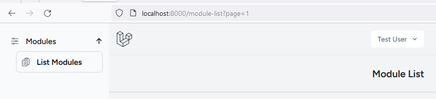
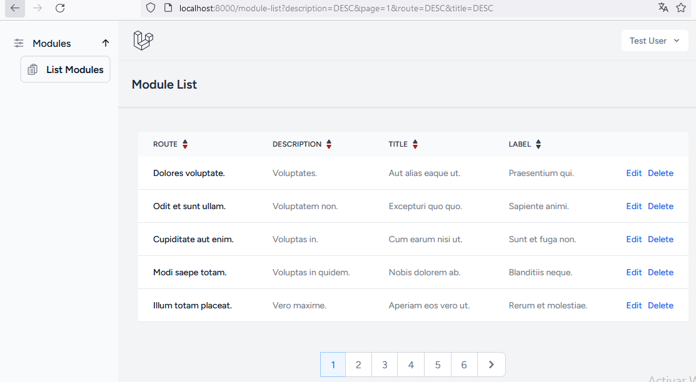
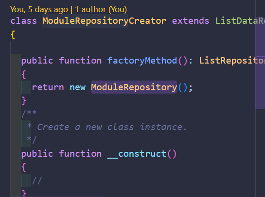
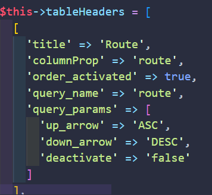
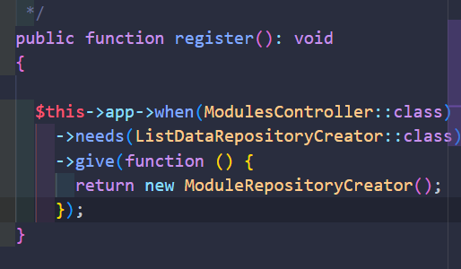
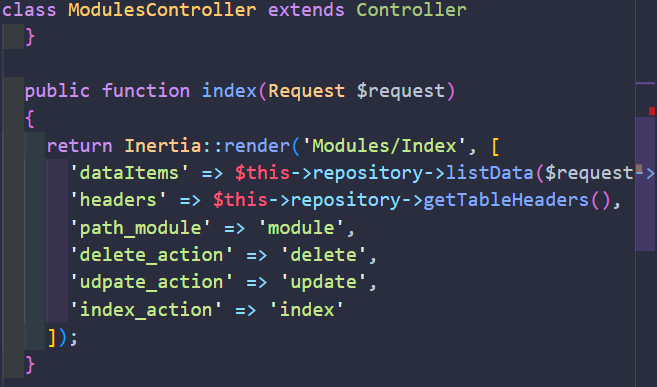
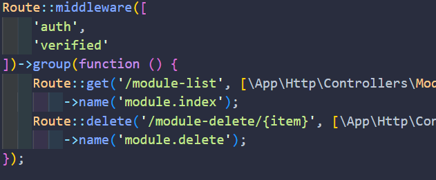

## CRM ADMINISTRATOR

- The following project is built with: Php, javascript and typescript.

- The frameworks used are: Laravel, inertia.js and vue.js.

- The purpose of this project is to build a multi-purpose crm with reusable components such as:

- Navigation
- Tables
- Pagination
- Forms
- Manage different locations

## Navigation:

- You can customise your sidebar menu easily, inside the hook useNavItems.ts, you can create your menuItems and even their corresponding child menuItems.

- Make sure that the path that each item points to exists within the web.php file.

- The development uses a builder pattern, to facilitate the creation and configuration of each item.

## Tables:

- Inside resources\js\Pages\Modules\Index.vue exists an example of how to use CustomTableComponent.

- Steps to configure a table:

 - configure a ModuleRepositoryCreator class copy, and inside their factoryMethod; return an instance of ModuleRepository

 

 - configure an implementation of ListRepositoryInterface for example App\Classes\ModuleRepository, just there you can configure tableHeaders inside setTableHeaders()

  

 - params:

  - title: name of column on table.
  - columnProp: property mapped in collection.
  - order_activated: active order arrow.
  - query_name: query_param used to order.
  - up_arrow: up_arrow is selected.
  - down_arrow: down_arrow is selected.
  - deactivate: deactivate order.

  - inside getList() method you can configure the paginated query

  - inside RepositoryServiceProvider you can configure which RepositoryCreator class is to be injected into your controller

  

  - Inside your controller, for example: ModulesController, you can set a configuration like this:

  

  - 'path_module', 'delete_action', 'udpate_action' and 'index_action'. These parameters correspond to the routes configured in the web.php routes file where your routes should be pointing to the different controller methods.

  

## Pagination:

- Inside resources\js\Pages\Modules\Index.vue exists an example of how to use CustomTablePagination.

- You can configure pagination by adding this variables inside .env:

- DEFAULT_NUMBER_PER_PAGE_PAGINATION=5. (how many items are showed by page)
- DEFAULT_SHOW_NUMBER_PAGE_PAGINATION=10. (number of pages showed in pagination)

## Manage different locations:

- inside lang/es.json and lang/en.json you can put translations and then use useTranslations() hook for translating a text.

## For testing:

- unit/integration tests: phpUnit, vitest.
- e2e testing: laravel dusk

## command to run tests:

- phpUnit (unit/feature): php artisan test.
- vitest (unit/feature): npm run test.
- laravel dusk (e2e): php artisan dusk.
- note: to run e2e testing you must run the project first, so follow instructions on section "Configure project in local environment" and after run the project (npm run dev & php artisan serve) and only when the project is running you can run: laravel dusk (this command going to reset migrations, so when tests have finished, rerun seeders: php artisan migrate:refresh --seed)

## Requirements:

- Node 20.12.0.
- PHP 8.2.17.
- Laravel 11.

## Configure project in local environment:

- Clone this repo.
- run: npm install.
- run: composer install.
- change .env.copy file to .env.
- configure database in .env file (configure pagination variables as well).
- run: php artisan migrate.
- run: php artisan db:seed.
- run: php artisan ziggy:generate.
- run: php artisan ziggy:generate --types.
- to run test, first run: npm run build, then run: php artisan test, npm run test.
- run project: npm run dev & php artisan serve.
- go to /login path and enter with test@example.com, password: password.

